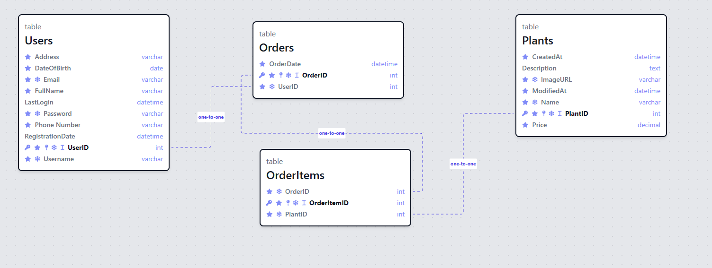

# Final Portfolio Project

Welcome to my final project for the Boolean 6 month Full Stack course. All of the features implemented are not 100% finished but this web app is something that I will continue to grow over time, to further my own skills.

## Technology

Technologies Used:

- **React**: A JavaScript library for building user interfaces.
- **HTML**: Hypertext Markup Language, the standard markup language for creating web pages and web applications.
- **CSS**: Cascading Style Sheets, a style sheet language used for describing the presentation of a document written in HTML.
- **Express**: A web application framework for Node.js, designed for building web applications and APIs.
- **Prisma**: A modern database toolkit for TypeScript and Node.js that simplifies database access with type safety.
- **Node.js**: A JavaScript runtime built on Chrome's V8 JavaScript engine, commonly used for building server-side applications.
- **PostgreSQL**: A powerful, open-source relational database system known for its reliability, robustness, and feature set.

## Deployment

The deployed application can be accessed [here](https://main--snazzy-starburst-1a86d8.netlify.app/).

## DOMAIN MODEL

**Entities**:
  **User**:
    **Attributes**:
        ID (integer)
        Email (string)
        Password (string)

**Relationships**:
  **User Authentication**:
    Users can authenticate by providing their email and password.
    The system verifies the provided credentials against the stored user data.

**Behaviors**:
  **User Authentication**:
      A user can attempt to log in by providing their email and password.
      If the provided credentials match a user's record in the system, the user is successfully authenticated.
      If the provided credentials do not match any user's record or are invalid, authentication fails.
**Actions**:
  **Sign Up**:
    Users can sign up by providing their email and password.
    Upon sign-up, the system creates a new user record with the provided email and password.
    If a user with the same email already exists, sign-up fails, and an error is returned.
  **Login**:
    Users can log in by providing their email and password.
    Upon successful login, the system grants access to the user's account.
    If the provided credentials are incorrect or do not match any user's record, login fails, and an error is returned.

**Use Cases**:
  **User Registration**:
    Actors: User
    Description: Allows a new user to create an account by providing their email and password.
    Preconditions: None
    Postconditions: A new user account is created if the provided email is unique.
  **User Authentication**:
    Actors: User
    Description: Allows a registered user to log in by providing their email and password.
    Preconditions: The user account must exist.
    Postconditions: The user is granted access to their account if the provided credentials are correct.

**Error Handling**:
    Actors: System
    Description: Handles errors that occur during the sign-up and login processes.
    Preconditions: Invalid or duplicate email, incorrect password.
    Postconditions: Error messages are returned to the user indicating the cause of the error.

## ERD

